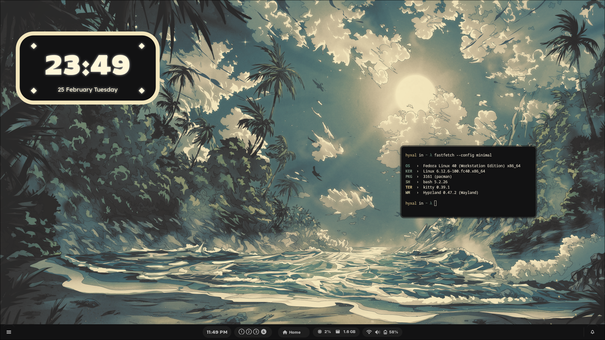

# Hyxal's Dotfiles
 A Collection of Dotfiles i've built....

- **Window Manager ⚙️**      -   [Hyprland](https://github.com/hyprwm/Hyprland)
- **Lockscreen 🔒**          -   [Hyprlock](https://github.com/hyprwm/hyprlock)
- **Widgets & Bar 🧩**       -   [AGS](https://github.com/Aylur/ags)
- **Launcher 🚀**            -   [Rofi](https://github.com/davatorium/rofi)   
- **Notification-Daemon 🔔** -   [SwayNC](https://github.com/ErikReider/SwayNotificationCenter) 
- **Terminal 🖥️**            -   [Kitty](https://github.com/kovidgoyal/kitty)   
- **Wallpaper Manager 🖼️**      -   [SwayBG](https://github.com/swaywm/swaybg)

Note: Fonts will have to be manually downloaded, Links at the end of page
## Kadal - കടൽ
 

## Neela - നീല

## Hanafuda - 花札
 

#### Fonts:
- [Circle Outline PhotoSupply & Circle PhotoshopSupply](https://www.photoshopsupply.com/fonts/circle-font)
- [Inter](https://fonts.google.com/specimen/Inter)
- [Rowdies](https://fonts.google.com/specimen/Rowdies)
- [Pixelfy Sans](https://fonts.google.com/specimen/Pixelify+Sans)
- [Anton](https://fonts.google.com/specimen/Anton)
-  Font awesome 6 Free (Check Your Package Manager)
#### Wallpapers:
- [**Hanafuda** - Heroku](https://www.heroku.com/art/hanafuda)
- [**Neela** - Edernity](https://wall.alphacoders.com/big.php?i=1358522)

Thanks to https://github.com/adi1090x/rofi for the Rofi Applets